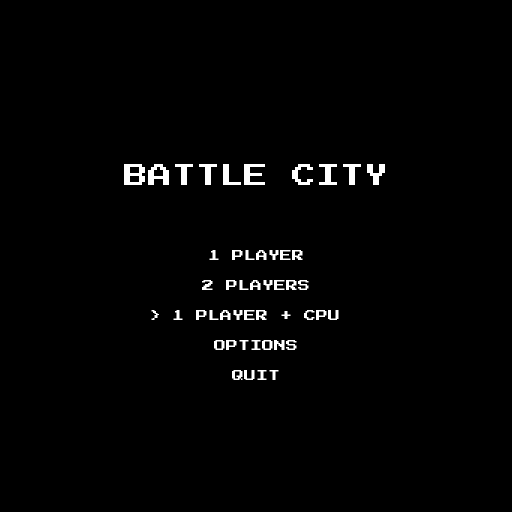
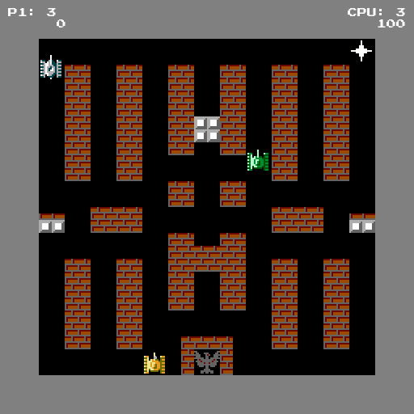

# Battle City Clone

A Python and Pygame implementation of the classic NES game Battle City, featuring all 35 stages, four enemy tank types, power-ups, two-player co-op, a computer-controlled partner, sound effects, gamepad support, and more.

<p align="center">
  
  
</p>

## Installation

Download the latest build from the [Releases page](https://github.com/StefanBS/battle-city-clone/releases/latest). Each release also has a `SHA256SUMS` file to check your download against.

### Windows

1. Download `BattleCitySetup-<version>.exe`.
2. Run it. It installs for your user only, so it doesn't need administrator rights.
3. The installer isn't code-signed, so Windows SmartScreen may warn you. Choose **More info**, then **Run anyway**.
4. Start **Battle City** from the Start menu.

To check the download in PowerShell, compare the hash with the one in `SHA256SUMS`:

```powershell
Get-FileHash .\BattleCitySetup-<version>.exe -Algorithm SHA256
```

### Linux

The game ships as a Flatpak bundle. It needs [Flatpak](https://flatpak.org/setup/) and the Flathub remote, which provides the runtime it's built on:

```bash
flatpak remote-add --user --if-not-exists flathub https://dl.flathub.org/repo/flathub.flatpakrepo
flatpak install --user BattleCity-v<version>.flatpak
flatpak run com.battlecity.BattleCity
```

The game also appears in your desktop's application menu. To remove it, run `flatpak uninstall --user com.battlecity.BattleCity`.

### macOS

There's no packaged macOS build yet, so run the game from source. [uv](https://docs.astral.sh/uv/) downloads the right Python version for you:

```bash
curl -LsSf https://astral.sh/uv/install.sh | sh
git clone https://github.com/StefanBS/battle-city-clone.git
cd battle-city-clone
uv sync
uv run python main.py
```

The same steps work on Linux. On Windows, install uv with `powershell -ExecutionPolicy ByPass -c "irm https://astral.sh/uv/install.ps1 | iex"` and then run the same `git clone`, `uv sync` and `uv run` commands.

## Features

- **35 stages** authored in [Tiled](https://www.mapeditor.org/) with varied enemy compositions
- **4 enemy tank types** — basic, fast, power, and armor — each with unique sprites and stats
- **6 power-ups** — helmet, star, grenade, clock, shovel, extra life
- **Game modes**: 1 Player, 2 Players (co-op), and 1 Player + CPU, where a [CPU Partner](docs/cpu-partner.md) drives P2 by the same rules as a human
- **Gamepad/controller support** — D-pad, analog sticks, hot-plug detection (SDL GameController API)
- **Sound effects** — shooting, explosions, power-ups, engine sounds, and more
- **Difficulty levels** — Easy (random Enemy AI) and Normal (directional bias, aligned shooting, type-specific tactics)
- **Options menu** — difficulty selection and master volume with persistent settings
- **Stage transitions** — curtain animations between stages
- **Explosion animations** — small and large explosions, spawn effects
- **Shield animation** — flicker effect on spawn invincibility
- **Tile types** — brick (destructible, with variants), steel, water, bush (overlay), ice (sliding physics), base

## Controls

### Keyboard

| Action        | Key              |
|---------------|------------------|
| Move          | Arrow keys       |
| Shoot         | Space            |
| Pause / back  | Esc              |
| Menu navigate | Arrow keys       |
| Menu confirm  | Enter / R        |

### Gamepad

| Action        | Button                          |
|---------------|---------------------------------|
| Move          | D-pad / Left analog stick       |
| Shoot         | A / B                           |
| Pause / back  | Start                           |
| Menu navigate | D-pad / Left analog stick       |
| Menu confirm  | A                               |
| Menu back     | B                               |

### Who controls which Player

| Mode           | P1                         | P2                                  |
|----------------|----------------------------|-------------------------------------|
| 1 Player       | Keyboard or any controller | —                                   |
| 1 Player + CPU | Keyboard or any controller | CPU Partner                         |
| 2 Players      | Keyboard (first controller if two are connected) | First controller (second if two are connected) |

With no controller connected, both Players in 2 Players mode share the keyboard's keys.

## Project Structure

```
battle-city-clone/
├── src/
│   ├── core/                              # Game entities
│   │   ├── game_object.py                 # Base class (position, rect, draw, update)
│   │   ├── tank.py                        # Tank base (movement, shooting, health)
│   │   ├── player_tank.py                 # Player tank (respawn, lives, Stars, shield)
│   │   ├── enemy_tank.py                  # Enemy tank (4 types, Carrier flashing)
│   │   ├── enemy_ai.py                    # Enemy AI: direction and shooting intent
│   │   ├── bullet.py                      # Bullet (directional movement, bounds checking)
│   │   ├── tile.py                        # Tile types, collision properties, variants
│   │   ├── map.py                         # TMX map loading, tile grid, spawn points
│   │   ├── effect.py                      # Visual effects (explosions, spawn)
│   │   └── power_up.py                    # Power-up entity (blink, timeout, collection)
│   │
│   ├── managers/                          # Game systems
│   │   ├── game_manager.py                # Main loop; pygame adapter around the Screen Flow
│   │   ├── screen_flow.py                 # Screens, menus, curtain and which Stage comes next
│   │   ├── battle.py                      # One Stage: frame pipeline, outcomes, Game Over / Victory
│   │   ├── tank_stepper.py                # Steps every tank through a frame; owns the bullets
│   │   ├── player_manager.py              # Player slots: tanks, inputs, lives, and score
│   │   ├── enemy_manager.py               # Enemies on the battlefield, their AIs, Frozen
│   │   ├── player_input.py                # Per-player gameplay input (keyboard/controller)
│   │   ├── world_view.py                  # Read-only per-frame snapshot for Player inputs
│   │   ├── cpu_partner.py                 # CPU Partner input (Goals, aiming, safe shots)
│   │   ├── goal_timing.py                 # CPU Partner decision timing and hesitation
│   │   ├── pathfinding.py                 # A* over the sub-tile grid
│   │   ├── steering.py                    # CPU Partner: getting unstuck
│   │   ├── cut_off.py                     # CPU Partner: Refused Shots, given-up sides, Cut Off
│   │   ├── dodge.py                       # CPU Partner: Dodge reflex against Incoming Shots
│   │   ├── footprint.py                   # Grid cells a tank covers; blocked Enemy Spawn Points
│   │   ├── input_handler.py               # Menu and system input (SDL GameController API)
│   │   ├── menu_controller.py             # Declarative menu navigation (items + callbacks)
│   │   ├── collision_manager.py           # Finds and responds to collisions; returns outcomes
│   │   ├── outcomes.py                    # Collision outcome types
│   │   ├── spawn_manager.py               # The Stage's Roster, spawn timer and animations
│   │   ├── renderer.py                    # Rendering pipeline (logical -> display surface)
│   │   ├── texture_manager.py             # Sprite atlas slicing and caching
│   │   ├── effect_manager.py              # Effect lifecycle management
│   │   ├── power_up_manager.py            # Power-up spawning, collection, effects
│   │   ├── sound_manager.py               # Sound effect loading and playback
│   │   └── settings_manager.py            # Persistent game settings (volume, difficulty)
│   │
│   ├── states/
│   │   ├── screen.py                      # Screen enum (TITLE_SCREEN, RUNNING, PAUSED, ...)
│   │   ├── battle_result.py               # BattleResult enum (Game Over, Victory)
│   │   └── game_mode.py                   # GameMode enum (1 Player, 2 Players, 1 Player + CPU)
│   │
│   └── utils/
│       ├── constants.py                   # Sizes, speeds, grid dimensions, enums, colors
│       ├── animation.py                   # Blink timing helper
│       └── paths.py                       # Resource path resolution (dev and packaged)
│
├── assets/
│   ├── battle-city.tiled-project          # Tiled project (custom types and enums)
│   ├── sprites/                           # Sprite sheet (sprites.png) and tileset (sprites.tsx)
│   ├── sounds/                            # Sound effects (.wav)
│   └── maps/                              # 35 TMX level maps
│
├── tests/
│   ├── conftest.py                        # Shared fixtures
│   ├── unit/                              # Entity and manager unit tests
│   └── integration/                       # End-to-end tests with real objects
│
├── scripts/
│   ├── generate_icons.py                  # App icon generation
│   └── generate_sounds.py                 # Sound effect generation
│
├── docs/
│   ├── cpu-partner.md                     # How the CPU Partner decides (state diagrams)
│   ├── adr/                               # Architecture decision records
│   └── images/                            # README screenshots
│
├── installer/                             # Platform-specific packaging
├── main.py                                # Entry point
├── battle-city.spec                       # PyInstaller build spec
├── pyproject.toml                         # Project configuration and dependencies
├── CONTEXT.md                             # Domain glossary (Player, Goal, Roster, ...)
└── README.md
```

## Documentation

- [CONTEXT.md](CONTEXT.md): the domain language used in code, tests and docs
- [docs/cpu-partner.md](docs/cpu-partner.md): how the CPU Partner picks and pursues its Goals
- [docs/adr/](docs/adr/): architecture decisions
  - [0001](docs/adr/0001-cpu-partner-as-player-input.md) CPU Partner is a PlayerInput, not a tank subclass
  - [0002](docs/adr/0002-one-stepping-path-for-all-tanks.md) Every tank goes through one stepping path
  - [0003](docs/adr/0003-collision-response-returns-outcomes.md) Collision response returns outcomes
  - [0004](docs/adr/0004-a-battle-owns-one-stage.md) A Battle owns one Stage
  - [0005](docs/adr/0005-dodge-is-a-reflex-not-a-goal.md) Dodge is a reflex, not a Goal
  - [0006](docs/adr/0006-spawning-and-the-enemies-on-the-battlefield-stay-separate.md) Spawning and the Enemies on the battlefield stay separate

## Development Setup

Requires Python 3.13+.

1. Install [uv](https://docs.astral.sh/uv/) (if not already installed):
```bash
curl -LsSf https://astral.sh/uv/install.sh | sh
```

2. Create and activate a virtual environment:
```bash
uv venv
source .venv/bin/activate  # On Windows: .venv\Scripts\activate
```

3. Install dependencies:
```bash
uv pip install -e ".[dev]"
```

4. Run the game:
```bash
python main.py
```

## Testing

```bash
# Run all tests
pytest

# Run tests with coverage
pytest --cov=src

# Run a specific test file
pytest tests/unit/core/test_tank.py

# Run a specific test
pytest tests/unit/core/test_tank.py::TestTank::test_shoot
```

## Linting, Formatting and Type Checking

```bash
ruff check src/ tests/
ruff format src/ tests/
mypy src
```

The pre-commit hooks and CI run all three.

## Building

To build a standalone executable:

```bash
uv pip install -e ".[build]"
pyinstaller battle-city.spec
```

Release builds are made by CI when a `v*` tag is pushed: a Windows installer (PyInstaller + Inno Setup, `installer/windows/`) and a Linux Flatpak (`installer/linux/`).
