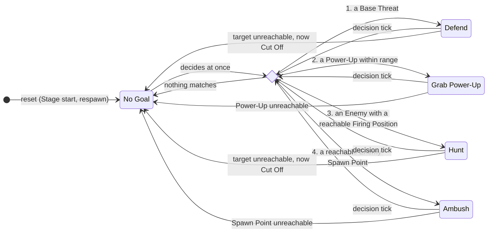
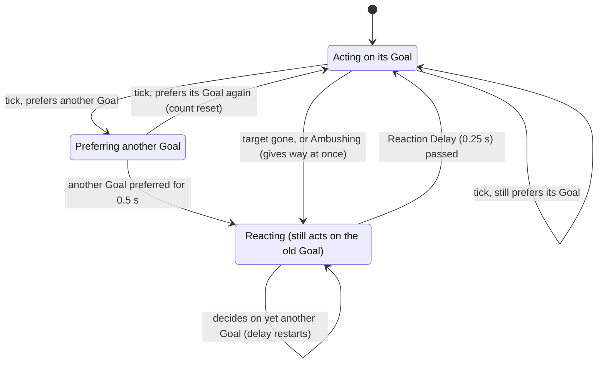
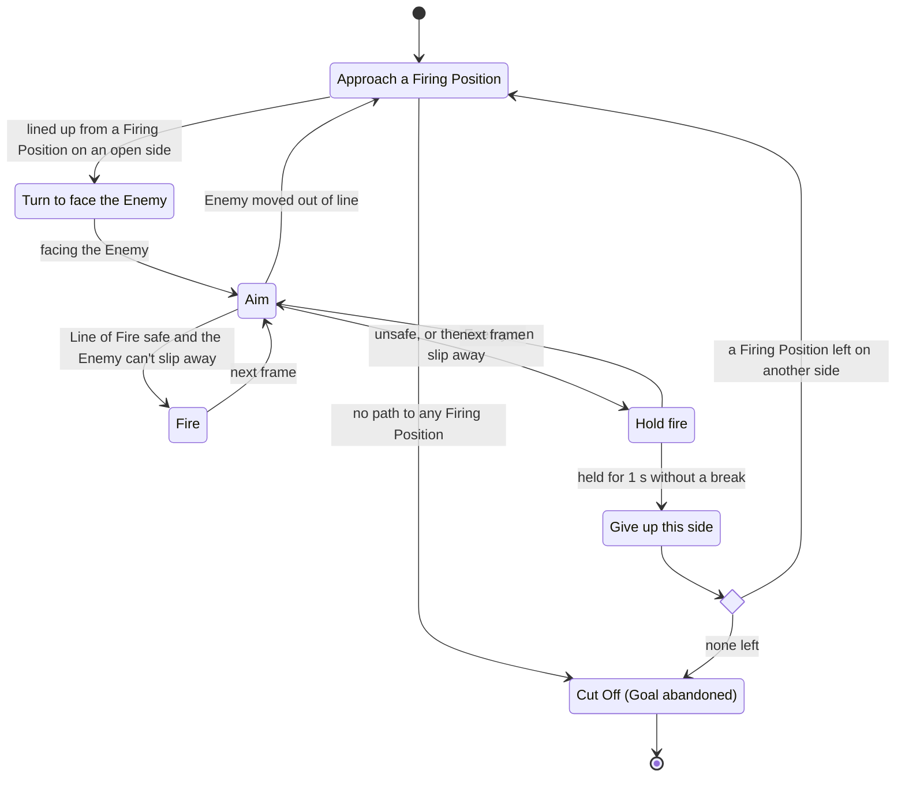

# CPU Partner

The CPU Partner is the computer-controlled Player in the P2 slot of a
**1 Player + CPU** game. It fights on the Human Player's side, takes no orders,
and follows exactly the same rules as a Human Player: it is a `PlayerInput`
paired with an ordinary `PlayerTank` (see
[ADR 0001](adr/0001-cpu-partner-as-player-input.md)). Terms in **bold** or
capitalised (Goal, Firing Position, Cut Off, ...) are defined in
[CONTEXT.md](../CONTEXT.md).

## Where it lives

| Module | Responsibility |
|---|---|
| `src/managers/cpu_partner.py` | `CpuPartnerInput`: picks a Goal and turns it into a movement direction and shoot requests. Also the pure checks `is_line_of_fire_safe`, `can_evade_shot` and `ambush_positions`. |
| `src/managers/goal_timing.py` | `GoalTiming` (when it decides, Goal stickiness, Reaction Delay) and `Hesitation` (holding back a shot now and then). |
| `src/managers/world_view.py` | `WorldView`: the read-only snapshot it decides from. Lines of Fire, Firing Positions, Base Threats. |
| `src/managers/pathfinding.py` | `NavGrid` and A* `find_path` over the sub-tile grid, for the tank's full footprint. Bricks are passable at extra cost (it shoots through them). Base Wall bricks never are. |
| `src/managers/steering.py` | `Steering`: notices it is stuck and picks the tanks to route around. |
| `src/managers/refused_shots.py` | `RefusedShots`: how long it has stayed lined up on a target without a safe shot. |
| `src/managers/enemy_memory.py` | `EnemyMemory`: per-Enemy facts (Cut Off, given-up sides) kept until the Enemy moves. |

Tuning values are the `CPU_PARTNER_*` constants in `src/utils/constants.py`.

## The frame loop

Each frame, `Battle` builds one `WorldView` and `PlayerManager.observe` hands
each Player's input its own view of it (`WorldView.for_player`). Human inputs
ignore it. `CpuPartnerInput.observe` then:

1. tells `Steering` whether last frame's move got it anywhere,
2. settles its Goal through `GoalTiming` (diagrams 1 and 2),
3. acts on that Goal (diagram 3 for Defend and Hunt), and
4. passes the shot through `Hesitation`.

`TankStepper` reads the result through `get_movement_direction()` and
`consume_shoot()`, the same way it reads a keyboard. `reset()` clears
everything it has decided, learned or planned. It runs at Stage start and on
respawn.

## 1. Choosing a Goal

At each decision the CPU Partner works out the Goal it prefers right now.
Priority runs from top to bottom: the first rule that matches wins. Cut Off
Enemies are left out of every rule.

- **Defend** targets the Base Threat nearest the Base.
- **Grab Power-Up** targets the Power-Up cheapest to reach, and only if the
  path costs at most `CPU_PARTNER_POWER_UP_RANGE` (10 sub-tile steps, bricks at
  their extra cost).
- **Hunt** keeps its current target while that Enemy lives. Otherwise it takes
  the Enemy whose Firing Position is cheapest to reach.
- **Ambush** keeps its current Enemy Spawn Point. Otherwise it takes the one
  cheapest to reach, then waits at a Firing Position at least
  `CPU_PARTNER_AMBUSH_DISTANCE` sub-tiles away from it, facing it. It never
  waits on a Spawn Point, since that would stop Enemies from spawning there.
- Decisions happen every `CPU_PARTNER_DECISION_INTERVAL` (0.25 s). They also
  happen at once when it has no Goal or its Goal's target is gone (destroyed,
  collected).
- A preferred Goal doesn't take over straight away. Diagram 2 shows the
  stickiness and the Reaction Delay between "prefers" and "acts on".

## 2. Switching Goals: stickiness and Reaction Delay

`GoalTiming` keeps two Goals: the one it has **decided** on and the one it is
**acting** on. They differ only during the Reaction Delay.

- **Stickiness** (`CPU_PARTNER_GOAL_STICKINESS`, 0.5 s) counts the time it
  has preferred *any* other Goal, even if that Goal changes along the way. If
  only one particular Goal counted, it could never switch while its preference
  kept changing, for example when two Base Threats take turns being nearest
  the Base.
- **Ambush** is only waiting, so it gives way to any other Goal at once.
- **Reaction Delay** (`CPU_PARTNER_REACTION_DELAY`, 0.25 s): after deciding
  on a new Goal, it keeps acting on the old one until the delay passes.
- **Abandoning** a Goal (its target can't be reached) drops the Goal it is
  acting on. A newer Goal it has decided on but not yet reacted to is kept.

## 3. Engaging an Enemy (Defend and Hunt)

Both Goals that target an Enemy run the same per-frame logic. Nothing here is
stored between frames except the refused-shot count, the given-up sides and
the Cut Off list, so "states" are what it finds each frame.

- **Approach**: A* to the cheapest Firing Position on a side it hasn't given
  up. It shoots a brick that blocks the next step once it faces it, but only
  when that shot is safe. When it has been stuck for `CPU_PARTNER_STUCK_TIME`,
  it routes around the tanks right ahead of it until they move. If only the
  Human Player is in the way, it waits and never pushes.
- **Lined up** means the centers are within half a sub-tile
  (`CPU_PARTNER_ALIGN_TOLERANCE`) on the cross axis, and the Line of Fire
  from there counts as a Firing Position for the target.
- **Safe** (`is_line_of_fire_safe`): the bullet can't hit the Base or a Base
  Wall cell, even past the target, and no Human Player stands in the Line of
  Fire before the target or the first solid tile.
- **Can slip away** (`can_evade_shot`): the Enemy is in a corridor walled on
  both sides of the Line of Fire, and can drive to an exit and clear the
  bullet's lane before the bullet arrives. Frozen or stationary Enemies can't
  slip away, and neither can an Enemy on open ground.
- **Hesitation**: each time it starts aiming, there is a 10% chance
  (`CPU_PARTNER_HESITATION_CHANCE`) it holds fire for 0.3 s. This happens after
  the logic above and doesn't count as a refused shot.
- **Given-up sides and Cut Off** are kept in `EnemyMemory` and forgotten as
  soon as the Enemy moves to another cell. The Enemy then becomes a candidate
  for every Goal again.

Grab Power-Up only uses the Approach step, toward cells where its tank would
touch the Power-Up. Ambush uses Approach and then turns to face the Enemy Spawn
Point and waits there. It doesn't fire at an empty Spawn Point. It changes Goal
to Defend or Hunt once an Enemy appears.

## Testing

- Unit tests: `tests/unit/managers/test_cpu_partner.py` builds `WorldView`s by
  hand and checks the movement and shots that come out.
- Integration: `tests/integration/test_cpu_partner_integration.py` runs a real
  `GameManager` in 1 Player + CPU mode.
